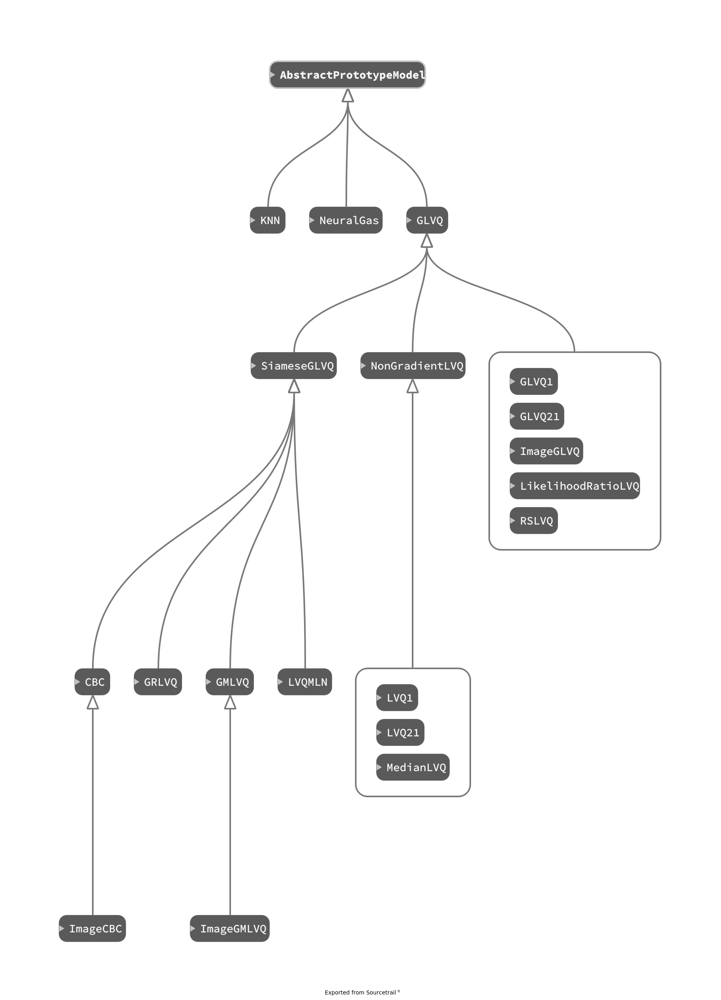

.. Available Models

Models
========================================

Unsupervised Methods
-----------------------------------------
.. autoclass:: prototorch.models.unsupervised.KNN
   :members:

.. autoclass:: prototorch.models.unsupervised.NeuralGas
   :members:

.. autoclass:: prototorch.models.unsupervised.GrowingNeuralGas
   :members:

Classical Learning Vector Quantization
-----------------------------------------
Original LVQ models introduced by :cite:t:`kohonen1989`.
These heuristic algorithms do not use gradient descent.

.. autoclass:: prototorch.models.lvq.LVQ1
   :members:
.. autoclass:: prototorch.models.lvq.LVQ21
   :members:

It is also possible to use the GLVQ structure as shown by :cite:t:`sato1996` in chapter 4.
This allows the use of gradient descent methods.

.. autoclass:: prototorch.models.glvq.GLVQ1
   :members:
.. autoclass:: prototorch.models.glvq.GLVQ21
   :members:

Generalized Learning Vector Quantization
-----------------------------------------

:cite:t:`sato1996` presented a LVQ variant with a cost function called GLVQ.
This allows the use of gradient descent methods.

.. autoclass:: prototorch.models.glvq.GLVQ
   :members:

The cost function of GLVQ can be extended by a learnable dissimilarity.
These learnable dissimilarities assign relevances to each data dimension during the learning phase.
For example GRLVQ :cite:p:`hammer2002` and GMLVQ :cite:p:`schneider2009` .

.. autoclass:: prototorch.models.glvq.GRLVQ
   :members:

.. autoclass:: prototorch.models.glvq.GMLVQ
   :members:

The dissimilarity from GMLVQ can be interpreted as a projection into another dataspace.
Applying this projection only to the data results in LVQMLN

.. autoclass:: prototorch.models.glvq.LVQMLN
   :members:

The projection idea from GMLVQ can be extended to an arbitrary transformation with learnable parameters.

.. autoclass:: prototorch.models.glvq.SiameseGLVQ
   :members:

Probabilistic Models
--------------------------------------------

Probabilistic variants assume, that the prototypes generate a probability distribution over the classes.
For a test sample they return a distribution instead of a class assignment.

The following two algorihms were presented by :cite:t:`seo2003` . 
Every prototypes is a center of a gaussian distribution of its class, generating a mixture model.

.. autoclass:: prototorch.models.probabilistic.SLVQ
   :members:

.. autoclass:: prototorch.models.probabilistic.RSLVQ
   :members:

Missing:

- PLVQ

Classification by Component
--------------------------------------------

The Classification by Component (CBC) has been introduced by :cite:t:`saralajew2019` .
In a CBC architecture there is no class assigned to the prototypes.
Instead the dissimilarities are used in a reasoning process, that favours or rejects a class by a learnable degree.
The output of a CBC network is a probability distribution over all classes.

.. autoclass:: prototorch.models.cbc.CBC
   :members:

.. autoclass:: prototorch.models.cbc.ImageCBC
   :members:

Visualization
========================================

Visualization is very specific to its application.
PrototorchModels delivers visualization for two dimensional data and image data.

The visulizations can be shown in a seperate window and inside a tensorboard.

.. automodule:: prototorch.models.vis
   :members:
   :undoc-members:

Bibliography
========================================
.. bibliography::